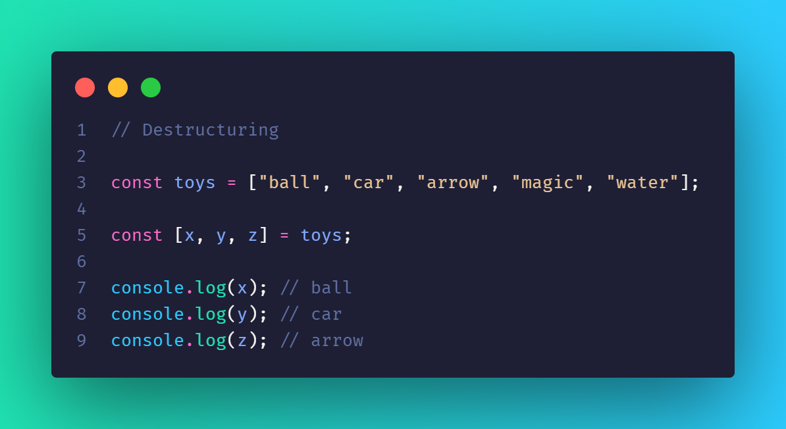
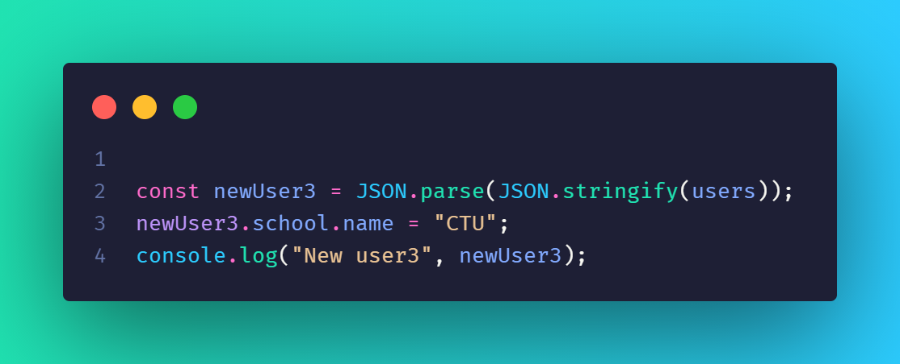
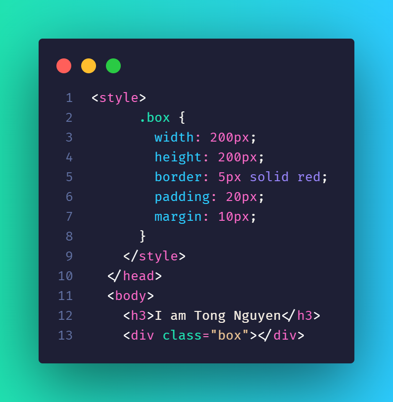

<!-- Lưu ý -->
<!-- 0837393959 thầy Quyền -->

# Khi nhấn một click next hoặc prev thì nhớ kiểm tra index, xong tăng hoặc giảm (xong kiểm tra )

### Shortcut

- header && header.classList.add("is-active");
  ==> if(header){
  header.classList.add("is-active")
  }

### Optional chaining (?) khi ta muốn truy xuất nhiều keys lồng nhau khi chưa khai báo ta dùng nó để hạn chế gây lỗi khi chưa có key của object đó (Lession 103) => undefine nếu chưa khai báo thay vì báo lỗi

```
  const student = {
    age:20,
    love: true,
    fullname: {
      name:"Thanh Tong"
    }
  }

console.log(student.fullname1?.girl); // undefined. nếu có fullname1 mới làm tiếp vế sau
console.log(student.fullname1.girl); // Cannot read properties of undefined (reading 'girl') => undefined.girl nên lỗi
```

- document.DocumentElement(thẻ <html></html> )

##Chữ radient
-webkit-background-clip: text;
-webkit-text-fill-color: transparent;

-các template được tạo ra trong DOM vì được sinh ra sau khi DOM đã load xong, khi web load xong rồi DOM add sự kiện không có nên trả về null
-> Thay vào đó ta bắt sự kiện từ body

<!-- Localstorage -->

-- Khi dung setItem => gia tri truyen vao phai la string => dung JSON.stringify
=> Ex: localStorage.setItem('todo_list',JSON.stringify(todoList));

<!-- Hoisting  -->

- Cần khai báo biến trước khi gọi biến đó
- Let và const đều bị hoisting
- Var không bị hoisting có thể gọi biến var trước khi khai báo nó

<!-- Clousure -->

- Function con có thể truy xuất tới scope của function cha.

-Ex1:
function sayHello(){
let message = "hi";
function sayHi(){
console.log(message);
}

    return sayHi;

}

const hello = sayHello() //Lúc này hàm sayHi chưa được gọi vì return về một hàm
hello() // Thế là hàm sayHi được được chạy

-Ex2:
function sayHello3(message){
return function sayYourName(name){
console.log(${message} ${name});
}
}

const hello2 = sayHello3("Hi I am");
hello2("Clousure");

# Date

- Lấy timestamp ta dùng hàm getTime();
- timestamp được tính bằng milisecond
- new Date(year,month,day,hour,minutes,second,milisecond)
- new Date(timestamp)
- new Date(date string);
- Tháng trong date bắt đầu từ 0-11
- Thứ trong tuần từ 0 -> 6. 0 -> Chủ nhật, 6 -> Thứ 7
- Tháng là phải trừ đi 1
- Để lấy ngày tháng năm của VN
  vd: const now = new Date();
  now.toLocaleString("vi-VI"); //In ra ngay thang nam cua VN

## String

# Slice

- Hàm slice(startIndex,endIndex -1);
- Lấy từ phần từ startIndex -> endIndex -1

# Splice

-Xoá hoặc thay thế phần tử gốc làm thay đổi mảng gốc

- splice(startIndex); => Tương tự như slice(startIndex);
- splice(startIdx,countDelete);
- splice(startIdx,countDelete,item1,item2,itemN); //item1,item2,itemN là những giá trị sẽ thay thế

  

# Sort

=> Sắp xếp các giá trị theo bảng mã Unicode-16
function sort((a,b)=>{
if(a>b) return 1; //Tăng dần
if(a<b) return -1; // Giảm dần
})

### Sự khác nhau giữa forEach và map

# Foreach thì không return, thường dùng chạy trong DOM, không thể dừng

# Map thì trả về một mảng mới dựa vào mảng ban đầu

### Sự giống nhau giữa some và every (đều trả về boolean)

# Để so sánh 2 mảng [array] ta dùng JSON.stringify để so sánh 2 mảng đó


## 2 cách sao chép mảng (clone) : dùng slice & spread operator: [...tenmang]

## 2 cách gộp mảng : dùng concat && spread operator [...mang1,...mang2,...mang3]

# Destructuring [x,y,z] = name array => tương ứng với từng giá trị trong array

# Để làm phẳng mảng ta dùng flat(số mảng con)

-> vd: flat(1) -> làm phẳng 1 mảng con



## Các giá trị falsy là : 0,undefine,null,NaN,"",false;

# Number

-> Math.sign(number) -> number là số dương => = 1, nếu là số âm => = -1;

- VD: Math.sign(12) // 1
- VD: Math.sign(-12) // -1

### [Object]

const student = {name:'Tong Nguyen',age:22,love:true,isDeveloper:true,hi: function(){console.log("Hi")}}

# Để xoá key trong object ta dùng phương thức delete

-> delete student.name;

# Object.keys: trả về một mảng chứa các keys của object

# Object.entries: trả về một mảng nested array [["name"],["Tong Nguyen"]] gồm có các cặp key và value


# Object.assign() dùng để gộp nhiều object lại với nhau


# Object.freeze(object) dùng để đóng băng key và value của object không thể thêm key và value mới vào object đã đóng băng


# Object.seal(object) cho phép chỉnh sửa key & value nhưng không được thêm key & value mới


# Để sao chép một object dùng spread operator {...object} hoặc Object.assign()

# Để sao chép một object clone nested ta dùng JSON.parse(JSON.stringify(tên object)) thì object ta có thể thay đôi thuộc tính mà không ảnh hưởng tới object gốc




### !Lưu ý: Thông thường typeof của [],{},null là object nên muốn kiểm tra có phải là object không thì nên xét hết các điều kiện

## Để kiểm tra một object có chứa keys nào đó hay không ta dùng (object.hasOwnerProperty(key)) nếu có trả về true, còn không có thì trả về false

## rest parameter (...rest) khi nó trong một function thì là một array

vd: function sum(num1,num2,...rest){
=> num1 = 1
=> num2 = 2
=> rest = [3,4,5,6]
}
sum(1,2,3,4,5,6)

<!-- DOM -->

#### querySelectorAll: nó có thể dùng loop và chỉ sử dùng được forEach !!

=> Sẽ trả về một NodeList giống như array

# attribute -> thuộc tính : href,class,id,src,style,...

- selector.getAttribute("attribute") => Lấy ra giá trị của attribute seletor.
- selector.removeAttribute("attribute") ==> Xoá attribute selector
- selector.hasAttribute("attribute") => Kiểm tra xen có attribute hay không, nếu có -> true, không -> false

## Node

# Kiểm tra element có childNode hay không, có -> true, không -> false

=> element.hasChildNodes()

# insertAdjacentText,insertAdjacentHTML,insertAdjacentElement

# element.insertAdjacentText("positon", "string");

- positon: beforebegin, afterbegin, beforeend,afterend
- string: text


# Để xoá Node ra khỏi DOM ta dùng removeChild => khi muốn xoá một nốt con ta tìm lên phần tử cha rồi mói xoá được node đó

- vd: selector.parentNode.removeChild(selector);

# Để lấy đƯợc element cha ta dùng

- parentNode
- parentElement

# nextElementSibling chọn phần từ kế tiếp nó

vd: span.nextElementSibling; => element span2
span.previousElementSibling => element p

  <h3>
      <!-- afterbegin -->
      <p></p>
      <span class="span">
        <a href="#">a</a>
      </span>
      <span class="span2"></span>
      <!-- beforeend -->
    </h3>

# previousElementSibling chọn phần từ trước nó

# childNode: trả về 1 mảng hết các node bên trong bao gồm textNodes

# children: trả về 1 mảng hết các node bên trong không bao gồm textNodes

# firstChild : trả về element đầu tiên bao gồm textNodes

# firstElementChild : trả về element đầu tiên không bao gồm textNodes

# lastChild & lastElementChild tương tự như trên nhưng lấy element cuối cùng

## Offset sizing && client

# Offset

- element.offsetWidth => trả về width của element đó
- element.offsetHeight => trả về height của element đó
- element.offsetLeft => vị trí của nó so với bên trái
- element.offsetTop => vị trí của nó so với phía trên cùng
- element.offsetParent => lấy ra phần tử cha để lấy giá trị của phần tử cha
  
  

# Client

- element.clientWidth => độ rộng của phần tử trừ đi border (2 bên)
- element.clientHeight => chiều cao của phần tử trừ đi border (trên dưới) (viewport)
- element.clientLeft => vị trí của nó so với bên trái border (!lấy border-left: )
- element.clientTop => vị trí của nó so với bên trên border (!lấy border-top: )

  

### For...in trong mảng thì lấy ra index của từng phần tử trong mảng

## window.innerWidth,window.outerWidth,window.innerHegiht,window.outerHeight

- inner là lấy vị trí của khung nhỏ (width | height)
- outer là lấy toàn khung màn hình (width | height)

  

## selector.getBoundingClientRect() -> Lấy ra kích thước toạ độ {left,width,height,top} của phần tử

- left,x: lấy vị trí của khối so với bên trái
- top: vị trí của khối so vớI bên trên
- bottom: chiều cao của khối + top
- right: độ rộng của khối + left
- width: độ rộng của khối
- height: chiều cao

#### HTMLCollection && NodeList

- Điểm giống: có thể truy cập bằng index, có độ dài length, giống mảng nhưng không hẳn là mảng tức không thể sử dụng các phương thức của mảng như push,map,shift,filter

- HTMLCollection: không thể sử dụng forEach
- NodeList : Sử dụng được forEach

# Có 2 cách convert HTMLCollection && NodeList(phiên bản thấp) to array => sau đó nó có thể dùng forEach, filter,...

-> Array.from(HTMLCollection,NodeList)
-> [...HTMLCollection,...NodeList] => operator

#### ParentNode && ParentElement

- parentElement: có thể null
- parentNode: nó lấy thẻ hiện tại của nó nếu nó không có cha lớn nhất bao ngoài

# insertBefore

-> parentNode.insertBefore(newnode,existingnode) => đưa element newnode lên trên element existingnode đã tồn tại.

# replaceChild(newnode,oldnode)

-> node.replaceChild(newnode,oldnode)

## Lưu ý

- Lỗi sai khi dùng function trong eventlistener

//Sai vì khi chưa click vào mà function đã involk nên dẫn đến sai sự kiện
element.addEventListener('click',handleClick())
// Đúng
element.addEventListener('click',handleClick);

# Bubbling

- Bắt sự kiện từ trong ra ngoài (từ thẻ click con đến thẻ cha bên ngoài)
  // Lúc này chỉ có span chạy vì đã chặn sự nổi bọt lên các phần tử cha
  // e.stopPropagation();
  // Nó chỉ chặn 1 sự kiện click , nếu phần tử có thêm một sự kiện thì nó sẽ chạy 2 sự kiện muốn chặn 1 sự kiện ta dùng stopImmediatePropagation();

# Capturing

- Bắt sự kiện từ ngoài vào trong
- Chuyền vào parameter là một object có key(capture: true) default: false; nếu không truyền thì nó sẽ bị bubbling
  // span.addEventListener(
  "click",
  function (e) {
  console.log("span click 2");
  },
  {
  capture: true,
  }
  );
  

## Sự khác nhau giữa e.target && e.currentTarget

-> e.target: sẽ chọn chính xác element mà mình click tới
-> e.currentTarget: nó sẽ chọn phần tử mà mình click (hoặc gắn sự kiện)

# h3 Để random các phần tử trong một mảng ta dùng arr[Math.floor(Math.random() \* arr.length)]

# event.target như một element của nó = this trong funtion (phần tử cha)

# h2 Toggle của classList: khi một class đã có rồi thì click vào nó sẽ xoá và khi nhấn một lần nữa thì nó sẽ được thêm vào

# h2 selector.contains(): kiểm tra element hoặc className có chứa element khác hay không

# e.target.matches(".className"): kiểm tra có trùng với className hay không

## Event mouse

- mousemove: khi di chuyển chuột trên phần tử đó
- mouseover: nó sẽ chạy khi rê chuột vào phần tử hoặc con của phần tử đó (từ trong đó rơi vào thẻ con của nó vẫn tính là 1 lần)
- mouseenter: nó sẽ chạy khi rê chuột vào phần tử
- mouseleave: nó sẽ chạy khi rê chuột ra khỏi phần tử
- wheel: lăn chuột (có e.delta => lăn lên => dương, lăn xuống => âm)

# Unset trong css để đưa giá trị đó về mặc định ban đầu

-> max-width: unset (lúc đầu phải set cho nó một giá trị)

# ClientXY và PageYY lấy toạ độ khi rê chuột

- clientY: Lấy toạ độ (chiều cao) theo viewport
- PageY: lấy theo toạ độ (chiều cao) theo document (thường thì có scroll nó sẽ khác viewport)

#### Form event

- keydown: Khi nhấn xuống (có preventDefault) (sẽ lấy hết các phím)
- keyup:Sự kiện xảy ra khi nhấn phím rồi thả ra (khong the dung preventDefault)
  -keypress: sẽ ignore(không nhận) các phím như home,pgUp,pgDown,Esc,Shift,Delele,Alt,Ctrl,.. (use preventDefault)
  -> thứ tự ưu tiên keydown -> keypress -> keyup
  -change: khi giá trị thay đổi và click ra ngoài hoặc nhân enter trong 1 lần
- focus: khi focus vào ô input sự kiện mới xảy ra
- blur : khi blur click ra khỏi ô input sự kiện mới xảy ra
- input: lấy giá trị khi chúng ta gõ

### Scroll

- debounce: là một kĩ thuật buộc một hàm phải đợi một khoảng thời gian nhất định trước khi thực thi.Trong khoảng thời gian đợi, một tác động sẽ điều bị bỏ qua và chỉ nhận duy nhất 1 hành động diễn ra trong thời gian chúng ta định trước.
- window.pageYOffset: khoảng cách thanh scroll của window theo chiều dọc so với phiếu trên cùng.
- window.pageXOffset: khoảng cách thanh scroll của window theo chiều ngang so với phiếu bên trái
  -scrollHeight: trả về chiều cao của element bao gồm paddig (+padding 2 bên), nhưng không có border
  -scrollWidth: trả về chiều rộng của element bao gồm paddig (+padding 2 bên), nhưng không có border

  - element.scrollTop: trả về thanh scroll so với trên cùng (windown khong dung duoc) (tựa như pageYOffset)
  - element.scrollLeft: trả về thanh scroll so với bên trái (windown khong dung duoc) (tựa như pageXOffset)

- element.scrollIntoView() : scroll tới phạm vi mà có thể thấy nó (có thể quay lại phần tử đƯợc trỏ tới)

[title] (https://s1.o7planning.com/vi/12397/images/41666223.png)

# offsetWidth & scrollWidth (offsetHeight & scrollHeight tương tự)

- offsetWidth -> Lấy ra độ rộng khi chúng ta set nó ban đầu
- scrollWidth -> Lấy ra độ rộng khi xuất hiện scroll hoặc có phần tử con lớn hơn độ rộng của nó.

## Để tính độ dài thực sự của scroll: ta lấy chiều cao của scroll(scrollHeight / scrollWidth) - chiều cao của viewport height (clienHeight or offsetHeight / clientWidth or offsetWidth)

# Cách lấy các thẻ input nhanh bằng cách gọi form.elements["name của input"].value;

<!-- ```html
<p>Thanh Tong</p>
``` -->

#### Regex

1. Regex.test(value) -> return true or false;

-2. Anchor
-> ^ là bắt đầu với kí tự => true or false;
-> $ là kết thúc với kí tự => true or false;

```html
console.log(/^hi/.test("hi 3")); // true console.log(/^hi/.test("hello 3
hi"));//false console.log(/hi$/.test("hello 3 hi")); //true
console.log(/hi$/.test("hello 3 hihi3")); //false
```


3.Range []

- [a-z]: là các từ a - z in thường
- [A-Z]:là các từ A - Z in HOA
- [0-9]: là các số từ 0 -> 9

# Dấu mũ nằm trong range [] là phủ định: [^] không trong khoảng

```
  /[^a-z]/.test("a") // false
```

4. Meta character
   

5. Quantifiers
   

6. Group ()

```
// có thể group nhiều regex lại với nhau và đặt thêm quantifier cho group
console.log(/(\d{3})(\w+)/.test("123")); // false
console.log(/(\d{3})(\w+)/.test("123abc")); //true
console.log(/(\d{3})?(\w+)/.test("123")); //true
```

7. Escaping (các kí tư đặc biệt \ \* $ ^ () {} + | . [])

- Để chèn các kí tự đặc biệt ta dùng dấu <strong>\</strong>
  -> /\?/.test("?");

  8.Boundaries \b \B

```
- \b: Có nghĩa là từ đó đứng riêng lẻ độc lập một mình ở mọi vị trí
-> "My name is Tong".match(/\bTong/g) //["Tong"]
- \B: Có nghĩa là một cặp từ nếu không có cặp từ (đứng trước nó) thì trả về null
"My name is TongNguyen".match(/\BTong/g) // null
"My name isTongNguyen".match(/\BTong/g) // ["Tong"]

```

[title](https://hocjavascript.net/tong-quan/regular-expression-trong-javascript/#B)

10. Sử dụng replace với regex

```
    const str = "Hello world hello";
    str.replace(/hello/gi, "Tong") // Tong world Tong
```

```
<!-- Sự khác nhau giữa onclick & addEventListener -->

- onclick: Chấp nhận 1 event handler
- addEventListener: Chấp nhận nhiều event handler cùng lúc.
- Tham số thứ 3 của addEventListener("click",handleClick,{once:true})
+ once: event chỉ chạy một lần duy nhất
+ capture: Chạy từ ngoài vào trong
```

## Chương II: Advance

1. Cách chuyển đổi dữ liệu

```
  const str = "123";
  const num = +str; => 123
  const bool = !!str; => true
  const emptystr = "";
  const boolstr = !!emptystr; => false;
```

- Chuyển sang number bằng cách sử dụng dấu '+'
- Chuyển sang boolean bằng cách dùng dấu '!!'

  2.Lưu ý khi dùng function với return

```
<!-- Trả về undefined vì khi return nó sẽ tự thêm dấu; vào sau return -->
function total(x,y){
  return
  x+y
}
```

3. Sư khác nhau giữa i++ và ++i

```
- i++: ráng giá trị i rồi mới tăng
- ++i: tăng giá trị i rồi mới gán

-- i++
let i = 1;
let j = i++;
console.log(i,j); // ráng j = 1 sau đó tăng i lên => i = 2, j = 1

-- ++i
let a = 1;
let b = ++a;
console.log(a,b); // tăng a lên = 2 sau đó ráng b = a => a = 2; b = 2;

```

4. arguments trong function

- Để kiểm tra giá trị có truyền vào hay chưa.

```
function number(a,b,c){
  <!-- check -->
  if(!arguments.length) console.log("Please enter your arguments");
  return a + b +c;
}

number() // =>"Please enter your arguments"
```

5. clousure in loop trong một function

- vòng lặp mà khai báo biến var thì var sẽ bị hoisting nó sẽ lấy giá trị cuối cùng nó sẽ trả về giá trị cuối cùng , scope của var sau mỗi vòng lặp thì nó không thay đổi

```
for (var i = 1; i < 5; i++) {
  setTimeout(() => {
    console.log(i);
  });
}
=> 5,5,5,5
```

- let thì không bị hoisting và scope của let thay đổi sau mỗi vòng lặp.
  for (let i = 1; i < 5; i++) {
  setTimeout(() => {
  console.log(i);
  });
  }
  => 1,2,3,4

6. Sự khác nhau giữa localStorage && sessionStorage

- localStorage: lưu trữ trên web khi reload vẫn còn, đóng tab hoặc trình duyệt vẫn còn
- sessionStorage: lưu trữ trên web khi reload vẫn còn, đóng tab hoặc trình duyệt sẽ mất

7. Những trường hợp không nên dùng arrow function

- Khi dùng arrow function trong function thì không thể dùng <b>this</b> được
- Trong object thì cũng không dùng <b>this</b> chỉ tới thằng cha đƯợc

8. Set

```
/ const mySet = new Set();
 mySet.add(1);
 mySet.add("Thanh Tong");
 console.log(mySet); //{ 1,"Thanh Tong"}
 console.log(mySet.has(1)); //true
 mySet.delete(1);
 console.log(mySet); //{ "Thanh Tong"}
 // Xoá tất cả
 mySet.clear();
 console.log(mySet); //{}

const arr = [2, 1, 3, 5, 6, 2, 4, 1, 5, 1, 1, 1, 4, 2, 4];

// Dùng set để tạo ra một giá trị object unique

const arr2 = new Set(arr);
console.log(arr2); //Set(6) { 2, 1, 3, 5, 6, 4 } => object

// Convert set to array
const newArr = Array.from(arr2); //[ 2, 1, 3, 5, 6, 4 ]
const newArr = [...arr2]; //[ 2, 1, 3, 5, 6, 4 ]
```

9.BOM
9.1 Location

```js
// BOM

// 1. Location
// console.log(window.location);
// console.log(location);
// http://127.0.0.1:5500/js/other.html?type=demo&page=2#title
// Lấy ra giá trị cần tìm trên thanh params
// Lấy ra được => type=demo&page=2
const params = new URLSearchParams(location.search);
// console.log(params.get("type"));
console.log(params.get("type"));
console.log(params.set("page", 10));
console.log(params.get("page")); //10 vì đã set ở trên
console.log(params.has("type")); //true
// console.log(params.delete("type"));
// console.log(params.get("type")); // null

// Để lấy key hoặc giá trị ta dùng for...of

for (let it of params.keys()) {
  console.log(it);
}

// Điều hướng
// setTimeout(() => {
//   location.href = "https://Hihi.com";
// });
```

9.2. History

```js
history.back(); // Quay lại trang trước đó <-
history.forward(); //Kế trang kế tiếp ->
history.go(); // Di chuyển tới trang: -1 => trang trước đó <-
```

9.3 Navigator (Kiểm tra thiết bị đăng nhập)

Systax:

```js
navigator.userAgent;
```
